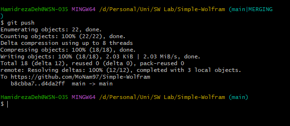
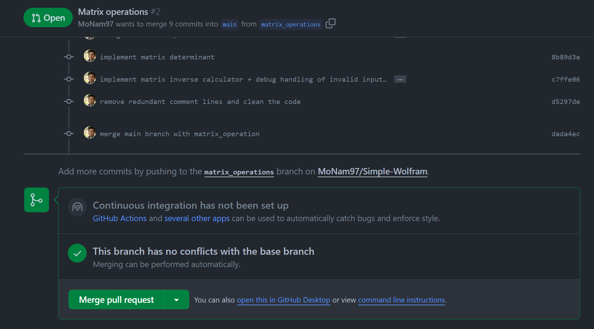

# گزارش پروژه اول (Simple Wolfram)
## مقدمه  
در این آزمایش ما قصد آشنایی با ابزار git 
و دستورات پرکابرد آن را داریم. به این منظور یک پروژه ساده با نام Simple Wolfram طرح کرردیم که با زبان پایتون پیاده سازی شده است. 
این پروژه یک برنامه ریاضیاتی ساده است که از سه بخش اصلی تشکیل می شود:

بخش اول (Calculator)
 اعمال ساده جمع، تفریق،ضرب و تقسیم به همراه توان و ریشه یابی است. 

بخش دوم (Matrix Operations)
عملیات های ماتریسی جمع، ضرب ماتریسی، محاسبه دترمینان و معکوس ماتریس است.

بخش سوم (Polynomial Computation)
با  گرفتن یک چند جمله از کاربر، مقادیر آن در نقاط مختلف و رسم نمودار آن را انجام میدهد

## رفع نیازمندی های آزمایش

### 1.مخزن گیت هاب پروژه (GitHub Repository)
مخزن این پروژه در 
[این آدرس](https://github.com/MoNam97/Simple-Wolfram)
در گیت هاب وجود دارد و قابل دسترسی عمومی است.


### 2. فایل gitignore.

با توجه به اینکه پروژه به زبان پایتون است فایل gitignore را برای زبان پایتون ایجاد کردیم. دراین فایل اسم و آدرس فایل هایی که که می خواهیم توسط گیت دیده نشوند و
 نمی خواهیم در مخزن گیت هاب قرار بگیرند، مثل فایل های میانی ناشی از اجرا مفسر پایتون از جمله pycache را مشخص می کنیم.
همچنین به این فایل آدرس فایل های تولید شده توسط IDE مورد استفاده را نیز اضافه می کنیم.


### 3. commit ها

در فرآیند توسعه پروژه بیش از 30 کامیت معنادار انجام شد که روند کلی آن ها در ادامه آمده است. <br>
با پیاده سازی ساختار اولیه پروژه و یک رابط کاربری ساده شروع به کار کردیم. سپس با اضافه کردن هر یک از ماژول ها، به طور مثال توان در بخش calculator، یک کامیت انجام دادیم.
همچنین برای رفع اشکال های کد ، تمیز کردن کد و برطرف کردن خطا ناشی از merge conflict نیز کامیت های مربوطه را انجام داده ایم.

تصاویر گزیده ای از کامیت های در ادامه آمده است:


### 4. سه شاخه معنادار پروژه

با توجه به تعریف پروژه ما سه شاخه polynomials ، main
 و matrix_operations ایجاد کردیم، بخش اول (Calculator) که
 در واقع یک ماشین حساب ساده است در شاخه main پیاده شده است.
    بخش دوم که عملیات های ماتریسی است در شاخه matrix_operations توسعه یافته و بخش سوم قسمت های مربوط به محاسبات روی چندجمله ای هاست که در برنچ Polynomials‌ پیاده سازی شده است.
.

 با پایان یافتن هر کدام از بخش ها، آن ها را با شاخه main ادغام کردیم.

 


### 5. رفع merge conflic ها

در فرآیند توسعه پروژه در دو قسمت دچار conflict شدیم؛
هم در یک شاخه و هم هنگام ادغام دو شاخه.

در توسعه بخش اول در شاخه main، از آنجایی که هر دو عضو تیم در یک فایل کار می کردیم و غالبا مجبور به تغییر یک تابع بودیم، مثلا برای به روز کردن رابط کاربری، در مواردی به conflict برخوردیم. در این مواقع  با بررسی کد تصمیم متناسب را برای کد ادغام شده گرفتیم.

در ادامه تصایری از یکی از این موارد آمده است:





در ادغام دو شاخه main و matrix_operations نیز با conflict مواجه شدیم. در این مورد ابتدا با بررسی کد تصمیم متناسب را برای کد ادغام در شاخه  matrix_operations گرفتیم؛ سپس با توجه به protected بودن شاخه main
با ایجاد یک pull request آن را با شاخه اصلی ادغام کردیم.


یکی از مصادیق conflict در ادغام کد:


اما در ادغام main و polynomial به conflict برنخوردیم.

### 6. اعمال محدودیت برای شاخه اصلی(main) و محافظت از آن

همانطور که در کلاس هم گفته با رفتن در تنظیمات مخزن گیت هاب وارد قسمت Branches شده و برای شاخه اصلی(main) محدودیت ایجاد کردیم. این محدودیت به این صورت است که هر کامیتی که قرار است در شاخه اصلی انجام شود، باید حتما از یکی از شاخه های دیگر به صورت pull request ادغام شود.

 
 

ادغام کردن شاخه main با شاخه matrix_operations در گیت هاب:




### 7. نحوه اجرای برنامه
در این بخش به طور مختصر سه بخش برنامه توضیح داده میشوند.
منوی اصلی به صورت زیر است:


قسمت مربوط به ماشین حساب:


قسمت مربوط به ماتریکس:


قسمت مربوط به عملیات های چندجمله ای:


## پاسخ به سوالات

### 1. پوشه‌ی .git چیست؟ چه اطلاعاتی در آن ذخیره می‌شود؟ با چه دستوری ساخته می‌شود؟

پوشه .git یک دایرکتوری مخفی در یک مخزن محلی گیت است که شامل تمام فایل های پیکربندی(configuration) و داده ها تشکیل دهنده مخزن است. این پوشه برای عملکرد Git بسیار مهم است و اطلاعات مختلفی را از جمله
 تمام اطلاعات مربوط به commit ها و آدرس مخزن remote را ذخیره می کند.
 
 یک دسته بندی کلی از اطلاعات و دایرکتوری های موجود در این به شرح زیر 
 است:
 1. پایگاه داده object ها: 
 دایرکتوری ` git/objects ` شامل تمام داده های مربوط به commit ها، درختان و غیره در یک فرمت فشرده است.
 2. مراجع:
  دایرکتوری ` git/refs ` ارجاعات مربوط به commit ها، شاخه ها، تگ ها و موارد دیگر را ذخیره می کند.
 3. پیکربندی (configuration):
 فایل `git/config` حاوی تنظیمات پیکربندی خاص مخزن است.
 4. شاخص (Index):
 فایل `git/index` که به عنوان ناحیه مرحله بندی نیز شناخته می شود، تغییراتی را که قرار است انجام شوند ذخیره می کند.
 5. گزارش‌ها (logs) و تاریخچه:
  دایرکتوری git/logs گزارش‌های عملیات مختلف و به‌روزرسانی‌های مرجع را ذخیره می‌کند.
 6. چنگک (Hooks):
  دایرکتوری git/hooks به شما امکان می دهد اسکریپت های سفارشی را تعریف کنید که می توانند توسط رویدادهای خاص Git فعال شوند.

ضمنا این پوشه هنگام ساخت مخرن گیت و با دستور زیر ایجاد می شود:
```
git init
```
<br>

### 2. منظور از atomic بودن در atomic commit و atomic pull-request چیست؟

معنا atomic در مصادیق گفته شده
به معنای <b>غیر قابل تقسیم بودن (indivisible)</b> است.

پس atomic commit به این معنا است که همه تغییرات صورت گرفته در این commit را می توان به صورت یک واحد مستقل و اصطلاحا (self-contained) در نظر گرفت. در نتیجه اگر commit موفقیت آمیز باشد، تمام تغییرات به صورت یک واحد منسجم ثبت می شود. اگر خطاها یا مشکلاتی وجود داشته باشد که مانع از انجام commit شود، هیچ چیز انجام نمی شود و مخزن در حالت قبلی خود باقی می ماند.

در رابطه با pull request، یک atomic pull-request یعنی
 تغییرات ارائه شده در آن pull request مستقل و self-contained هستند.
این تغییرات باید از نظر منطقی مرتبط باشند، و pull request باید کامل، یعنی شامل تمام کدها، آزمایش‌ها و مستندات لازم باشد.
<br>

### 3. تفاوت دستورهای fetch و pull و merge و rebase و cherry-pick را بیان کنید.

### 4. تفاوت دستورهای reset و revert و restore را بیان کنید.

هر 3 این دستورات جهت نوعی بازگشت در گیت هستند ولی تفاوت های جدی با هم دارند:
reset، جهت آپدیت شاخه مورد نظر استفاده می شود و تاریخچه کامیت ها را تحت الشعاع قرار می دهد، ‌ممکن است چیزی از آن کم کند یا به آن اضافه کند. به عبارتی امکان unstage‌ کردن و uncommit کردن را به ما می دهد.
revert، یک کامیت ثبت میکند که محتویات آن undo شده کامیت انتخابی است. به اینصورت با revert‌ کردن کامیت x، علاوه بر کامیت x، یک کامیت y=undo(x) نیز در تاریخچه کامیت ها ثبت خواهد شد.
restore، در حقیقت زمای که میخواهیم به محتویات کامیت های انتهایی برویم از این دستور استفاده میکنیم. به نوعی تغییرات unstaged‌ را undo میکند. توجه کنید این دستور برنچ را آپدیت نمیکند.

### 5. منظور از stage چیست؟ دستور stash چه کاری را انجام می‌دهد؟

stage گام ماقبل کامیت است. به عبارتی پس از تغییرات روی فایل ها، وضعیت آن ها را به staged تغییر میدهیم و به این معناست که این تغییرات آماده کامیت هستند.
stash به این صورت عمل میکند که تغییرات را تا آن لحظه (چه staged files و چه unstaged files) را ذخیره میکند تا در آینده مورد استفاده قرار گیرد. سپس به آخرین کامیت ثبت شده برمیگردد. این دستور برای زمانی مناسب است که تغییراتی دادیم که نمیخواهیم آن را کامیت کنیم یا آماده کامیت نیستند. به این صورت میتوانیم آن ها را به صورت ذخیره داشته باشیم. 

### 6. مفهوم snapshot به چه معناست؟ ارتباط آن با commit چیست؟

snapshot، به معنای وضعیت یک چیز (فولدر، فایل، ...) در یک لحظه به خصوص است. به عبارتی اطلاعات مربوط به آن لحظه را در خود ثبت میکند.
یک commit در حقیقت یک snapshot است به همراه یک سری اطلاعات لازم دیگر جهت تشکیل working tree. هر کامیت، علاوه بر snapshot اشاره گر هایی جهت تشکیل نگهداری درخت کار دارد. بعلاوه یک سری متادیتا در کامیت ها راجع به snapshot وجود دارند مانند نویسنده و توضیحات.
با استفاده از درخت کار که توسط کامیت ها تشکیل می شوند و snapshot موجود در هر کامیت،‌ تغییرات رخ داده روی پروژه به صورت تمام قابل بررسی و track‌ هستند.